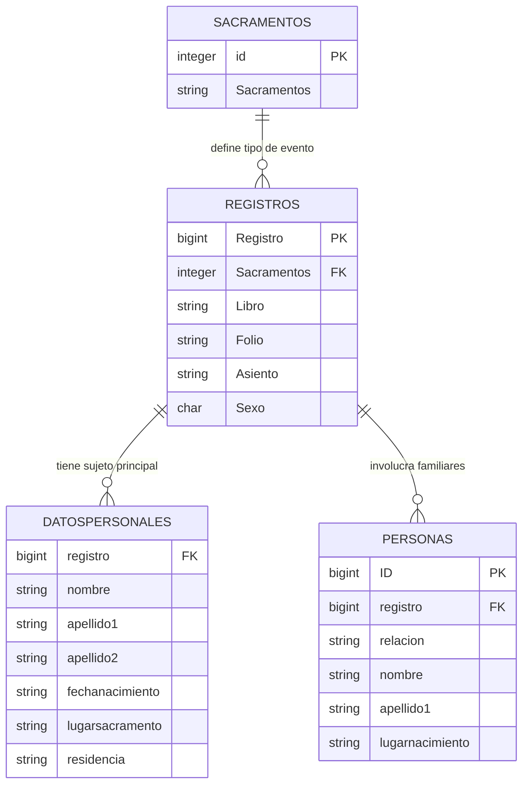

# Documentación de la Base de Datos Genealógica

Este documento proporciona una visión general y enriquecida de la estructura de datos y el propósito histórico de la base de datos analizada a partir del dump SQL de la parroquia de Valencia (siglos XVII-XVIII).

## 📝 Resumen del Contexto Histórico

La base de datos (con registros que datan en su mayoría de los años 1600-1699) ha sido diseñada meticulosamente para preservar los eventos sacramentales (principalmente bautizos y matrimonios). Estos registros son la pieza fundamental para la investigación en genealogía e historia demográfica de Valencia.

**Aspectos Destacados del Análisis de IA:**
- **Riqueza Demográfica:** A través de la tabla `DatosPersonales`, se puede mapear no solo los nacimientos sino los flujos migratorios y las zonas de residencia dentro y alrededor de parroquias como San Esteban Protomártir.
- **Microhistoria:** La tabla `Personas` captura de manera excepcional las redes y vínculos familiares (padres, abuelos, testigos).
- **Control de Archivo:** Todos los eventos preservan su "coordenada física" exacta (Libro, Folio, Asiento) en `Registros`, garantizando la verificabilidad académica frente al archivo en papel original.

---

## 🏗️ Estructura de Datos (Esquema Técnico)

### 1. `ab.Registros`
Constituye la tabla raíz o pivot. Modela de manera individual cada evento o sacramento ocurrido en la parroquia. Actúa como el puente principal entre la información material (física) y las personas.
- **Registro (PK / BIGINT):** Identificador unívoco del evento en el sistema.
- **Sacramentos (INTEGER):** Foreign Key.
- **Libro / Folio / Asiento (VARCHAR):** Coordenadas del archivo físico real.
- **Sexo (CHAR):** Género primario de la inscripción.

### 2. `ab.DatosPersonales`
Alberga los detalles biográficos específicos del sujeto central al que se refiere el sacramento (ej: el bautizado).
- **registro (FK / BIGINT):** Referencia a `Registros`.
- **nombre / apellido1 / apellido2 (VARCHAR):** Identificación unívoca del sujeto.
- **fechanacimiento / fechasacramento (VARCHAR/DATE):** Cronología del evento vital.
- **lugarsacramento / residencia (VARCHAR):** Geografía del evento.
- **oficiante / profesion / profesionpadre:** Contexto eclesiástico y socioeconómico.

### 3. `ab.Personas`
Modela el grafo relacional. Cataloga a todos los participantes secundarios (familiares) del mismo evento, creando el árbol genealógico orgánico.
- **ID (PK / BIGINT):** Clave de la tabla.
- **registro (FK / BIGINT):** Evento base que vincula a las personas.
- **relacion (VARCHAR):** Rol fundamental (e.g. 'PD' para Padre, 'MD' para Madre, 'E' Esposo).
- **nombre / apellidos / lugarnacimiento:** Detalles del pariente.

### 4. `ab.Sacramentos`
Tabla diccionario / Lookup table para normativización.
- **id (PK / INTEGER)**
- **Sacramentos (VARCHAR):** Conceptos litúrgicos estandarizados.

---

## 📊 Diagrama Entidad-Relación (ER)

A continuación se presenta la representación visual de las relaciones semánticas:



---

## 💡 Cómo Utilizar esta BD (Ejemplos Reales)

El proyecto cuenta con la herramienta `query_db.py` capacitada con el modelo de IA local, lo que permite realizar consultas en lenguaje natural en vez de usar SQL.

**Ejemplos de Preguntas Sugeridas a la Inteligencia Artificial:**

> ❓ *"En la estructura de la base de datos, ¿cómo se vinculan la tabla DatosPersonales con Personas para entender el árbol familiar de alguien?"*

> ❓ *"Soy un investigador intentando crear un diagrama. Dame una sentencia SQL que busque todos los matrimonios e incluya la información del esposo y la esposa."*

> ❓ *"¿Existe alguna manera de saber el lugar de residencia de los antepasados usando el esquema provisto?"*

**Ejecución:**
```bash
# Entra al directorio src y lanza el chat con contexto del informe:
python query_db.py --outdir ../data/output_optimized --report
```
*En pleno chat interactivo puedes usar el comando `!schema` o `!tablas` para recordar las estructuras al vuelo.*
