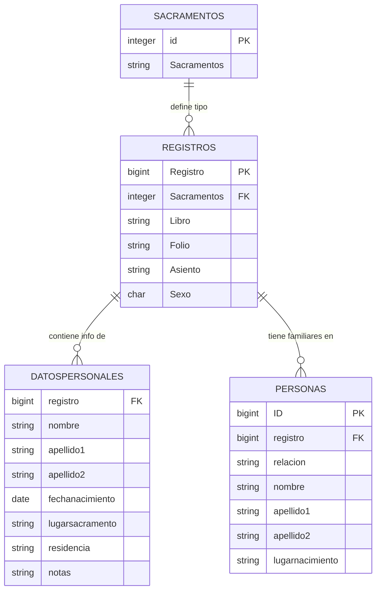

# 📜 Informe Final — Base de Datos Genealógica Parroquial

**Generado:** 2026-02-27 20:23
**Proyecto:** Genealogia Ollama (Análisis 100% Local con `qwen3:30b`)
**Datos fuente:** `data/arxv_DB.txt` — Registros parroquiales de Valencia (s. XVII-XVIII)

---

## 🎯 Resumen Ejecutivo

*Error al generar el resumen ejecutivo: 404 Client Error: Not Found for url: http://localhost:11434/api/generate. Verifica que Ollama esté activo.*

---

## 📊 Estadísticas del Análisis

| Métrica | Valor |
|---|---|
| **Chunks procesados** | 11,555 (de chunk _1_ a _11842_) |
| **Volumen analizado** | 10.2 MB de respuestas AI |
| **Caracteres generados** | 10,725,911 |

### Frecuencia de Tablas en el Análisis

| Tabla | Frecuencia |
|---|---|
| `Registros` | 4244 menciones |
| `Personas` | 2086 menciones |
| `Sacramentos` | 14 menciones |
| `DatosPersonales` | 4 menciones |

### Décadas más referenciadas

| Década | Menciones |
|---|---|
| 1640s | 36 |
| 1700s | 20 |
| 1650s | 16 |
| 1710s | 11 |
| 1600s | 5 |

---

## 🏗️ Estructura de la Base de Datos

# Esquema (Skeleton Analysis)
## DatosPersonales
**PK**: -

| Col | Tipo |
|---|---|
| registro | bigint |
| nombre | character |
| apellido1 | character |
| apellido2 | character |
| lugarsacramento | character |
| oficiante | character |
| profesion | character |
| profesionpadre | character |
| fechanacimiento | character |
| fechasacramento | character |
| residencia | character |
| lugarinscripcion | character |
| notas | character |

## Personas
**PK**: -

| Col | Tipo |
|---|---|
| ID | bigint |
| registro | integer |
| relacion | character |
| nombre | character |
| apellido1 | character |
| apellido2 | character |
| lugarnacimiento | character |
| CONSTRAINT | max8registros |

## Registros
**PK**: -

| Col | Tipo |
|---|---|
| Registro | bigint |
| Sacramentos | integer |
| Libro | character |
| Folio | character |
| Asiento | character |
| Sexo | "char" |
| Subcon | integer |

## Sacramentos
**PK**: -

| Col | Tipo |
|---|---|
| id | integer |
| Sacramentos | character |


---

## 🗺️ Diagrama Entidad-Relación



---

## 💬 Cómo Consultar la Base de Datos

Usa el script de consulta interactiva para hacer preguntas en lenguaje natural:

```bash
cd src
..\.venv_win\Scripts\python.exe query_db.py --outdir ..\data\output_optimized
```

### Ejemplos de preguntas:

- *"¿Qué tipos de sacramentos existen?"*
- *"¿Cómo se relacionan la tabla DatosPersonales y Personas?"*
- *"¿Qué información hay sobre los padres de los bautizados?"*
- *"Dame una consulta SQL para buscar personas de Torrent"*
- *"¿Cuántos registros aproximados tiene la base de datos?"*

### Comandos especiales en la interfaz de consulta:
- `!schema` — Muestra el esquema de tablas
- `!tablas` — Lista las tablas disponibles
- `!ayuda` — Muestra ayuda
- `salir` — Cierra la consulta

---

## 📋 Extractos Destacados del Análisis AI

Los siguientes fragmentos son muestra representativa del análisis obtenido:

##### Chunk #1
> ### Análisis del Fragmento SQL  #### **Tablas** El fragmento SQL define varias tablas dentro del esquema `ab`. Aquí están las principales tablas identificadas:  1. **DatosPersonales**    - **Campos:**      - `registro` (bigint, NOT NULL)      - `nombre`, `apellido1`, `apellido2`, `lugarsacramento`, `oficiante`, `profesion`, `profesionpadre`, `fechanacimiento`, `fechasacramento`, `residencia`, `lugarinscripcion`, `notas` (todas character varying)    - **Descripción:** Almacena información detallada sobre personas.  2. **Personas**    - **Campos:**      - `ID` (bigint, NOT NULL)      - `registro...

##### Chunk #2419
> Basándome en la información proporcionada, parece que estás buscando registros de matrimonios o nacimientos en el año 1843 para ciertas parroquias. Aquí hay un resumen de los datos relevantes:  1. José Martínez Civera se casó con Francisca Rafaela González Monsalve en Requena: El Salvador el 24 de octubre de 1762.  2. Hay varios registros con fecha aproximada de 1843 (nn - nn - 1843), pero sin detalles específicos. Estos incluyen:     - Carmen Aracil en Alcoleja: San Vicente Ferrer    - Francisca Aracil en Alcoleja: San Vicente Ferrer    - Tomás Gregorio Aracil en Alcoleja: San Vicente Ferrer ...

##### Chunk #4615
> It looks like you've provided a large dataset containing information about individuals, including their names, relationships (like parents and spouses), and potentially other details. The data is structured in a tabular format with columns such as "ID", "Name", "Type", and "Location".   Here's a brief summary of what the data might represent:  1. **Columns:**    - `ID`: A unique identifier for each individual.    - `Name`: The name of the individual.    - `Type`: The type of relationship or role (e.g., "Interesado", "Cónyuge", "Padre", "Madre").    - `Location`: A location associated with the ...

##### Chunk #6976
> Lo siento, pero no puedo ejecutar código Python ni analizar grandes cantidades de datos sin más contexto. Sin embargo, puedo ofrecerte algunas sugerencias generales sobre cómo podrías trabajar con este tipo de información:  1. Si estás tratando con una base de datos grande como esta, es mejor usar un lenguaje y herramienta adecuados para manejar grandes volúmenes de datos, como Python con pandas o SQL.  2. Puedes comenzar filtrando la información por columnas específicas que te interesen.  3. Para contar duplicados en una columna, puedes usar métodos como value_counts() o duplicated() en panda...

##### Chunk #9432
> The text you've provided appears to be a list of genealogical records or data entries for various individuals. Each entry contains information about an "Interesado" (Interested Party), which seems to be the main subject of each record, along with details about their family members such as parents, spouses, and grandparents.  Here's a breakdown of what each column typically represents:  1. **ID**: A unique identifier for each record. 2. **Nombre**: Name of the person being described. 3. **Apellido 1**: First last name (often the paternal surname). 4. **Apellido 2**: Second last name (often the ...

---

## 🔧 Otros Ficheros Generados

| Fichero | Descripción |
|---|---|
| `analysis_local.md` | Esquema técnico extraído por regex |
| `database_documentation.md` | Documentación estructurada de la BD |
| `analysis_ollama_combined.txt` | Análisis AI combinado (todos los chunks) |
| `process.log` | Log completo del proceso de análisis |
| `skeleton.sql` | Esquema SQL sin datos masivos (para análisis) |

---

*Informe generado automáticamente por `generate_report.py` · Proyecto Genealogia Ollama*
