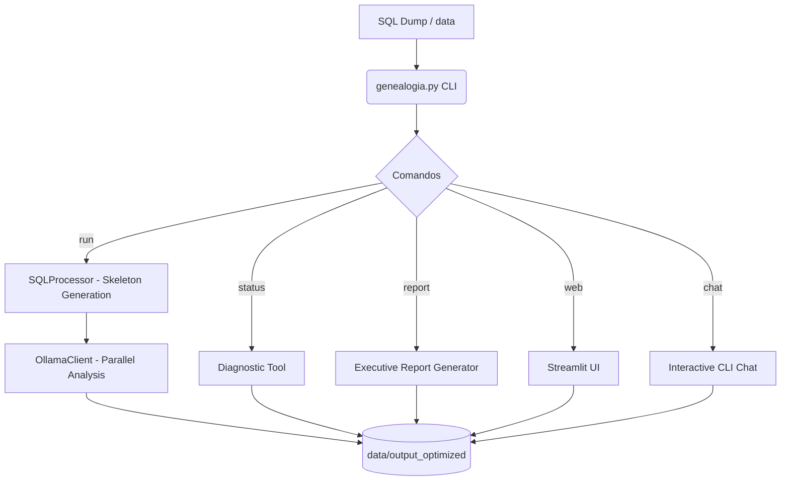

# 🧬 Genealogia Ollama

Analizador local inteligente de bases de datos genealógicas SQL utilizando LLMs locales via Ollama.

## 🏗️ Arquitectura del Proyecto



## 🚀 Inicio Rápido

### Requisitos
- **Python 3.10+**
- **Ollama** con el modelo `qwen3:30b` (u otro de tu preferencia).

### Instalación
1. Clona el repositorio.
2. Crea un entorno virtual e instala las dependencias:
   ```bash
   python -m venv .venv
   source .venv/bin/activate  # En Windows: .venv\Scripts\activate
   pip install -r requirements.txt
   ```

## 🛠️ Uso del CLI Unificado

El comando principal es `genealogia.py`.

| Comando | Descripción | Ejemplo |
|---------|-------------|---------|
| `run` | Inicia el análisis paralelo | `python genealogia.py run --sql db.sql --outdir output` |
| `status` | Verifica progreso y huecos | `python genealogia.py status --outdir output [--json]` |
| `web` | Lanza la interfaz Streamlit | `python genealogia.py web` |
| `chat` | Chat interactivo en terminal | `python genealogia.py chat --outdir output` |
| `report` | Genera informe final .md | `python genealogia.py report --outdir output` |

## 🐳 Docker (Opcional)

Puedes ejecutar la interfaz web mediante Docker:

```bash
docker-compose up --build
```
*Nota: Asegúrate de que Ollama sea accesible desde el contenedor (configurado por defecto como `host.docker.internal`).*

## 🧪 Pruebas
Ejecuta la suite de pruebas con:
```bash
python -m pytest
```

---
*Desarrollado para la preservación y análisis de registros parroquiales históricos.*

## 🎯 Propósito del Proyecto
El objetivo principal es procesar archivos SQL inmensos (1.3GB+) para extraer, documentar y permitir la consulta interactiva de su estructura y contenido. Emplea un enfoque híbrido de alta eficiencia:

1. **Smart Skeleton Filtering**: Extrae en segundos el esquema exacto mediante Regex y una pequeña muestra de datos representativa, descartando los millones de filas repetitivas.
2. **Análisis Semántico Local**: El modelo de IA (`qwen3:30b` o similar vía Ollama) digiere el "skeleton" en paralelo para explicar la lógica profunda del modelo de datos histórico (siglos XVII-XVIII).

## 🚀 Características Principales
- **Zero-Cloud Architecture**: Todo el procesamiento se realiza en tu propia red local. Todos los datos, hasta el último byte, quedan en disco de forma segura.
- **Rendimiento Extremo**: El procesamiento optimizado por skeleton y el cálculo multi-hilo reducen análisis que tomarían días a apenas minutos.
- **Full Continuity (Resume)**: Sistema robusto que permite reiniciar y continuar tareas largas si son interrumpidas, conservando cada fragmento analizado.
- **Consulta Conversacional**: Herramienta `query_db.py` mejorada que retiene el historial de charla y te permite hacer preguntas sobre la BD en lenguaje natural ("Who are the parents matching this criteria?").

## 📁 Principales Ficheros y Directorios
- `genealogia.py`: **NUEVO** CLI unificado que orquesta la ejecución (run, chat, report, status).
- `requirements.txt`: Dependencias del sistema.
- `src/main_optimized.py`: Analizador inteligente principal con ThreadPoolExecutor.
- `src/generate_report.py`: Script creador de `final_report.md`.
- `src/query_db.py`: Prompt interactivo.
- `src/check_status.py`: Monitor de integridad del análisis.
- `data/output_optimized/`: Carpeta con los entregables finales (`analysis_local.md`, `database_documentation.md`, chunks de texto).

*Revisa `0-antigravity/behavior_rules.md` para las políticas de resiliencia de procesos del proyecto.*
